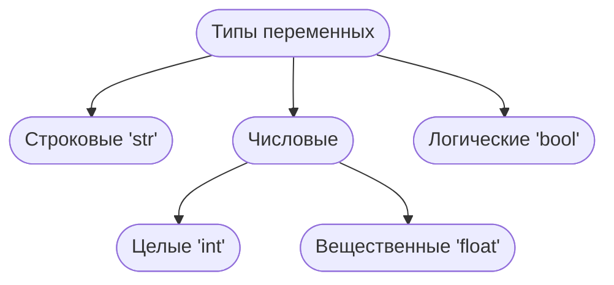

**Переменная** - это величина, имеющая имя, тип и значение. Значение переменной можно изменять во время программы.

### Для задания переменных:

> [!failure]+ Нельзя использовать:
> - **Скобки** `" ( ) "`
> - Знаки: `+,  =,  !,  ?`  и другие

> [!success]+ Можно использовать:
> - **Латинские буквы** `( A-Z, a-z )`. Заглавные и строчные буквы различаются
> - **Русские буквы** (не рекомендуется!)
> - **Цифры**. Имя не может начинаться с цифры
> - **Знак подчёркивания** `" _ "`
> 

---
### Сравнение имён переменных:


> [!failure]+ Неудачный выбор имени для переменных
> 
| **Неудачное** имя                    | Почему?                                                |
| ------------------------------------ | --------------------------------------------------------------- |
| `a = 56`<br><br>`num = 1.34`             | Другой программист не поймёт, что скрывается за этой переменной |
| `number_of_student_at_school = 1108` | Название слишком длинное. Его неудобно использовать             |

> [!success]+ Правильный выбор имени для переменных
> | **Удачное** имя                    | Почему?                                                |
| ------------------------------------ | --------------------------------------------------------------- |
| `surname = 'Иванов' ` <br><br> `ticket_price = 1999` <br><br> `amount_student = 826`| Название раскрывает назначение переменной <br><br> Коллега-программист сможет быстро прочитать программу и понять её суть |!

### Типы переменных



> [!example]+ Целое число
> ```py
> a = 4
> print( a )
> ```
> < ' int ' >

> [!example]+ [[4. Вещественные числа| Вещественное число]]
> 
> ```py
> a = 4.5
> print( a )
>```
>< ' float ' >

> [!example]+ [[1. Строки|Символьная строка]]
> 
> ```py
> a = " Вася "
> print( a )
> ```
 < ' str ' >
 
 > [!example]+ Логическая
 > ```py
 > a = True
 > print( a )
 > ```
 > < ' bool ' >

### Как записать значение в переменную?

```py
a = 5 
a = 7
'''
При записи нового значения, старое удаляется.
То есть, после того, как мы отметили, что a = 7, 'a' больше не равно 5
'''
```

---
### Проверка значений
==" type(значение для проверки) "== - возвращает тип данных введённого значения (числа, строки, вещественные числа, логические выражения True/False)

> [!example]+ Код
> ```python
> is_ready = True
> print(type(is_ready))
> ```
> > [!abstract]+ Вывод:
> > ```py
> > < class "bool" >
> > ```


